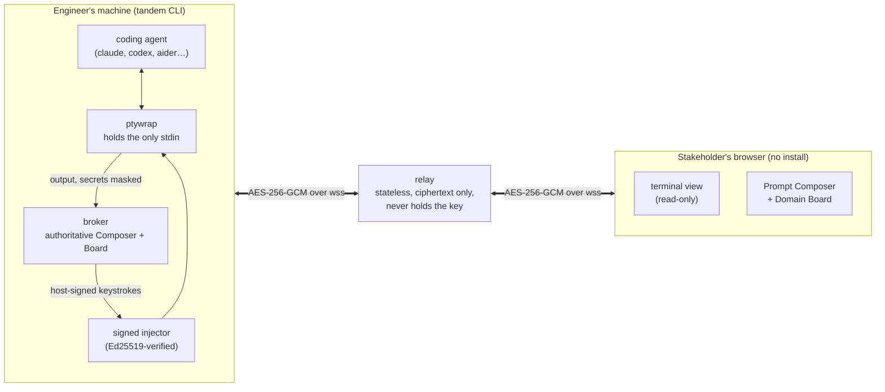
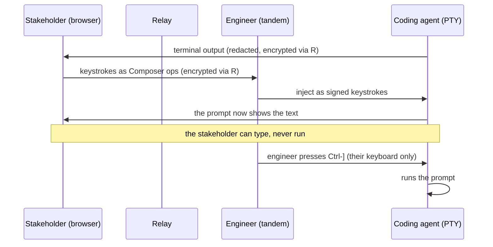

# Tandem

[](https://github.com/mherzog4/tandem/actions/workflows/ci.yml)
[](https://github.com/mherzog4/tandem/releases)
[](go.mod)
[](LICENSE)

**A shared seat inside the engineer's coding-agent session.** Share a live
terminal session (Claude Code, Codex, Gemini, Aider, Factory, or any command)
with a nontechnical stakeholder. They see everything and write straight into
the prompt that goes to the agent. They cannot run anything. Only the engineer
submits, approves tool calls, or reaches the shell.

Like Tuple, except you pair on the conversation with the agent instead of a
code editor.

## Why

Today the work passes from stakeholder to engineer to agent, and every hop
loses detail. The stakeholder describes what they want, the engineer rewrites
it as a prompt, the agent builds, and the misunderstanding surfaces days
later. Tandem drops the lossy middle hop for the part that matters most:
natural language. The stakeholder writes the intent in their own words,
straight into the prompt, while the engineer edits it, gates execution, and
adds the technical framing. A live Domain Board in the EventStorming style
records the shared vocabulary into `DOMAIN.md`, which the agent reads as
context on the next turn.

Full product rationale: [prd.md](prd.md).

## How it works

The host CLI (`tandem`) wraps the agent in a PTY and keeps the only handle to
its stdin. A relay forwards end-to-end-encrypted frames between the host and
its guests; it only ever sees ciphertext, because the session key rides in the
join link's `#` fragment, which browsers never send to a server. The guest
joins in a browser with no install. What they type shows up live in the
engineer's prompt; the engineer reviews it and presses `Ctrl-]` to run it.
Guests cannot execute. Their terminal is read-only and their keystrokes have
no path to the PTY, and every injected keystroke passes an Ed25519 signing
check first. That is a structural guarantee, not a hidden button. See
[docs/protocol.md](docs/protocol.md).



The gated loop: a stakeholder's keystrokes reach the agent only after the
engineer runs them, and only through the signing chokepoint.



## Install (host)

```sh
curl -fsSL https://raw.githubusercontent.com/mherzog4/tandem/main/scripts/install.sh | sh
```

Installs to `~/.local/bin`, no sudo. If that directory is not on your `PATH`,
the installer prints the one line to add it. Override the location with
`TANDEM_BIN_DIR` (for example `TANDEM_BIN_DIR=/usr/local/bin`, which does need
sudo).

On a Mac you can also use Homebrew:

```sh
brew tap mherzog4/tandem https://github.com/mherzog4/tandem
brew install tandem
```

macOS (arm64/x86_64) and Linux (x86_64/arm64). Windows runs under WSL. Guests
need nothing but a browser.

After installing, `tandem doctor` checks the relay and your terminal before
your first session.

## Use

```sh
tandem claude          # or codex, aider, gemini, or any command
```

`tandem` connects to the hosted relay by default, copies a join link to your
clipboard, and pauses so you can share it before the agent takes the screen.
Send the link to your stakeholder, then press Enter to launch.

The loop: they type in the browser, it appears live in your agent's prompt,
you review or edit it, and you press `Ctrl-]` to run it. They can watch and
write the prompt, but only your keyboard runs anything.

| Key or flag | What it does |
|-------------|--------------|
| `Ctrl-]` | run the composed prompt |
| `Ctrl-\` | privacy shutter (guest sees a paused card) |
| `--no-mirror` | stop mirroring into the prompt; guests compose in a side panel and `Ctrl-]` sends it |
| `--no-wait` | launch immediately instead of pausing to share the link |
| `--relay wss://…` / `TANDEM_RELAY` | use a different relay |
| `--no-share` | run locally with no session |

The link's `#` fragment holds the encryption key and never reaches the relay,
which forwards ciphertext only.

## Deploy your own relay (Railway)

Guests join through the relay, so it has to be publicly reachable over `wss://`.
The relay is a stateless single binary. Deploy it to Railway, which builds the
Dockerfile remotely so you need no local Docker:

```sh
railway init                                              # create the project
railway up                                                # remote build + deploy
railway domain                                            # get https://<name>.up.railway.app + TLS

# point join links at the public URL, then redeploy so it takes effect:
railway variables --set TANDEM_BASE_URL=https://<name>.up.railway.app
railway up
```

Then hosts connect to it:

```sh
tandem --relay wss://<name>.up.railway.app claude
```

Sessions live in the relay's memory, so keep it at one replica for now
(scale-out needs session affinity). Railway provides TLS automatically and
health-checks `/healthz`. The relay never sees plaintext or the encryption key
wherever it runs.

Public-endpoint limits, all optional env vars with sane defaults:

| Var | Default | Meaning |
|-----|---------|---------|
| `TANDEM_MAX_SESSIONS` | 200 | concurrent sessions cap |
| `TANDEM_CONN_PER_MIN` | 30 | new connections/minute per IP |
| `TANDEM_CONN_BURST` | 10 | per-IP burst allowance |

The relay pings each connection every 30s and reaps dead peers, so a host whose
network drops does not hold a session (a live but quiet session is kept). It
reads `X-Forwarded-For` for the real client IP behind the proxy.

## Develop

```sh
go test ./...        # tests
go build ./...       # build all
```

To cut a release, either push a `v*` tag (CI builds and publishes the
binaries) or cut one locally with no CI:

```sh
scripts/release.sh v0.1.0
```

That cross-compiles all four targets on your machine and publishes the GitHub
Release directly, using zero Actions minutes.

## Documentation

| Doc | Covers |
|-----|--------|
| [docs/protocol.md](docs/protocol.md) | wire protocol and the gated-input guarantee |
| [docs/compat.md](docs/compat.md) | agent compatibility, `--no-mirror`, dictation |
| [docs/latency.md](docs/latency.md) | latency targets and how they are measured |
| [prd.md](prd.md) | product requirements |

## Contributing

Contributions welcome. See [CONTRIBUTING.md](CONTRIBUTING.md), keep the
[security invariant](docs/protocol.md) intact, and run `go test -race ./...`.
Be kind ([Code of Conduct](CODE_OF_CONDUCT.md)). Found a vulnerability? Follow
[SECURITY.md](SECURITY.md) and report it privately rather than opening an issue.

## License

[MIT](LICENSE) © Matt Herzog
